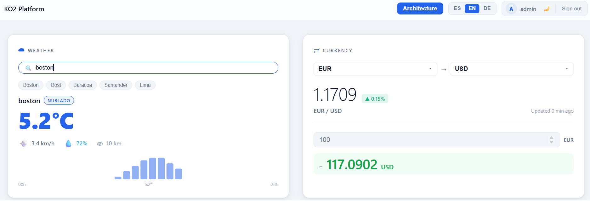
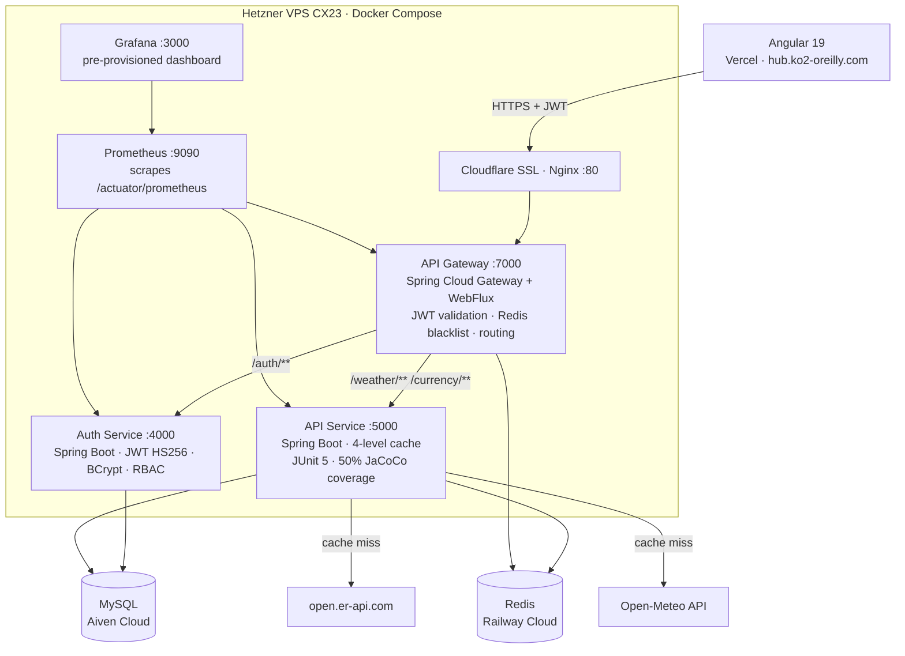
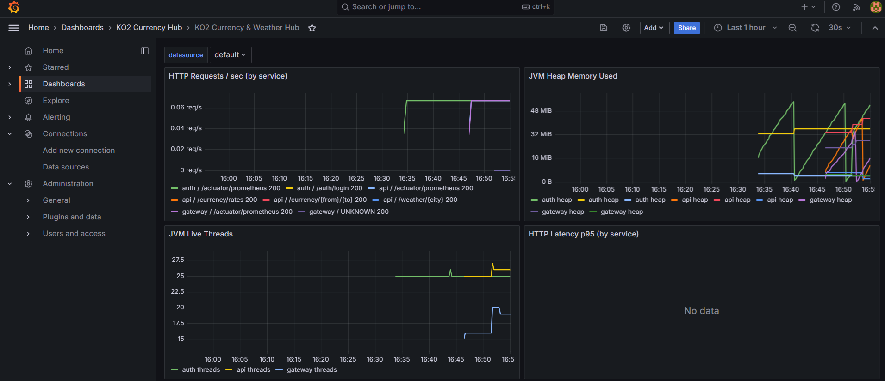

# KO2 Currency & Weather Hub


Real-time currency exchange and weather dashboard backed by three independently deployable Spring Boot microservices. JWT authentication, Redis token blacklist, a 4-level cache strategy, and full observability with Prometheus + Grafana — all running in production on a Hetzner VPS via Docker Compose and GitHub Actions CI/CD.



---

## Architecture



**Authenticated request flow:**
1. Angular sends `Authorization: Bearer <token>` → `api.ko2-oreilly.com`
2. Cloudflare terminates TLS → Nginx proxies to Gateway `:7000`
3. Gateway checks Redis blacklist + validates JWT signature
4. Gateway injects `X-User-Name` / `X-User-Roles` headers downstream
5. API Service reads headers via `HeaderAuthFilter` — no JWT re-validation, no secret sharing

---

## Tech Stack

| Layer | Technology | Why |
|---|---|---|
| Frontend | Angular 19 — standalone components, RxJS | Standalone API removes NgModules boilerplate; signals-ready |
| Gateway | Spring Cloud Gateway + WebFlux | Non-blocking reactive I/O; centralises auth so downstream services stay JWT-unaware |
| Auth Service | Spring Boot 3 · JWT HS256 · BCrypt | Isolated auth boundary; token blacklist in Redis covers logout without server state |
| API Service | Spring Boot 3 · JPA · RestTemplate | Business logic and cache isolated from auth; independently deployable |
| Database | MySQL on Aiven | Managed cloud — automatic backups, no DBA overhead for a solo-deployed project |
| Cache | Redis on Railway | Managed cloud; two distinct concerns: token blacklist (Gateway) and data TTL (API Service) |
| Observability | Prometheus + Grafana | Production metrics — request rate, p95 latency, JVM heap, error rates per service |
| Infrastructure | Hetzner VPS CX23 | Best cost/performance ratio in Europe for this workload |
| Deployment | Docker Compose + GitHub Actions | Right-sized for three services on one host; push to `master` → auto-deploy |
| SSL | Cloudflare Flexible | Edge TLS termination + DDoS protection at zero operational cost |

---

## Key Technical Decisions

### 1. Gateway owns authentication — services are JWT-unaware
The Gateway validates JWT once and injects plain HTTP headers downstream. No JWT library, no shared secret in API/Auth services. Changing the auth mechanism only requires touching one service.

### 2. Redis token blacklist with self-expiring keys
On logout, the token's remaining TTL is used as the Redis key expiry. The blacklist cleans itself — no cron jobs, no table growth. Checking a Redis key adds ~1 ms vs. a synchronous DB read on every authenticated request.

### 3. 4-level cache with stale fallback
```
Request → Redis (10 min TTL) → MySQL (< 10 min old) → External API → stale MySQL record
```
The stale fallback prevents hard 503s when upstream APIs (Open-Meteo, ExchangeRate) are temporarily unavailable. Redis handles hot sub-millisecond reads; MySQL provides persistence across Redis restarts.

### 4. Reactive gateway, blocking services
Spring Cloud Gateway runs on WebFlux (non-blocking). The two downstream services run on WebMVC (blocking/thread-per-request). This is intentional: the Gateway's job is routing at high concurrency — WebFlux fits. The business logic services are I/O-bound with simple CRUD; WebMVC is simpler to test and reason about.

---

## Observability

Prometheus scrapes `/actuator/prometheus` from all three services every 15 seconds. Grafana is auto-provisioned on startup with a pre-built dashboard.



**Dashboard panels:**
- HTTP requests/sec per service
- HTTP latency p95 per service
- 4xx / 5xx error rate
- JVM heap memory used
- JVM live threads
- Service UP/DOWN status

**Access in production:**
- Prometheus: `http://167.235.77.17:9090`
- Grafana: `http://167.235.77.17:3000` (login: `admin`)

---

## Live Demo

| | URL |
|---|---|
| Frontend | [hub.ko2-oreilly.com](https://hub.ko2-oreilly.com) |
| Swagger UI | [167.235.77.17:7000/webjars/swagger-ui/index.html](http://167.235.77.17:7000/webjars/swagger-ui/index.html) |

**Test credentials:**

| Username | Password | Role |
|---|---|---|
| `user` | `user123` | ROLE_USER |
| `admin` | `admin123` | ROLE_ADMIN |

---

## Testing

| | |
|---|---|
| Framework | JUnit 5 + Mockito |
| Tests passing | 15 |
| Coverage | 50.3% instruction coverage (JaCoCo) |

**Covered:** `WeatherService`, `CurrencyService`, `WeatherController`, `CurrencyController` — Redis cache hit, DB cache hit/expired, external API call, stale fallback, 404 city-not-found.

**Not yet covered:** `WeatherClient`, `CurrencyClient` (external HTTP), `HeaderAuthFilter` — next step via Testcontainers.

```bash
./gradlew test jacocoTestReport
# Report: build/reports/jacoco/test/html/index.html
```

---

## Related Repositories

| Repo | Description |
|---|---|
| [ko2-platform-frontend](https://github.com/ko2javier/ko2-platform-frontend) | Angular 19 SPA — dashboard, JWT auth flow, i18n (ES/EN/DE) |
| [auth-currency-data-hub](https://github.com/ko2javier/auth-currency-data-hub) | Auth Service :4000 — login, logout, JWT issuance, RBAC (USER / ADMIN / SUPERADMIN) |
| [currency-data-hub](https://github.com/ko2javier/currency-data-hub) | API Service :5000 — weather + currency endpoints, 4-level cache, 15 tests |
| [api-gateway-currency-data-hub](https://github.com/ko2javier/api-gateway-currency-data-hub) | Gateway :7000 — reactive routing, JWT validation, Redis blacklist |

---

## Local Setup

<details>
<summary>Run with Docker Compose</summary>

### Prerequisites
- Docker + Docker Compose
- `.env` file with required variables (see `.env.example`)

### Required environment variables

```env
JWT_SECRET=your_256bit_secret
DB_URL=jdbc:mysql://your-mysql-host:3306/ko2db
DB_USERNAME=your_user
DB_PASSWORD=your_password
REDIS_URL=redis://:password@host:port
AUTH_SERVICE_URL=http://auth-service:4000
API_SERVICE_URL=http://api-service:5000
GATEWAY_URL=http://localhost:7000
GRAFANA_PASSWORD=admin
```

### Start

```bash
git clone https://github.com/ko2javier/server-infrastructure.git
cd server-infrastructure/portfolio-backend
cp .env.example .env   # fill in your values
docker compose up -d
```

| Service | URL |
|---|---|
| Gateway + Swagger | `http://localhost:7000/webjars/swagger-ui/index.html` |
| Prometheus | `http://localhost:9090` |
| Grafana | `http://localhost:3000` |

</details>

---

## CI/CD

Each microservice repo has its own GitHub Actions workflow. On push to `master`:

1. SSH into Hetzner VPS
2. `git pull` in the service subdir
3. `docker-compose rm -f <service>` + `docker-compose up --build -d <service>`

Prometheus and Grafana are started once with `docker-compose up -d prometheus grafana` and persist via named volumes (`prometheus_data`, `grafana_data`).

---

## License

MIT
