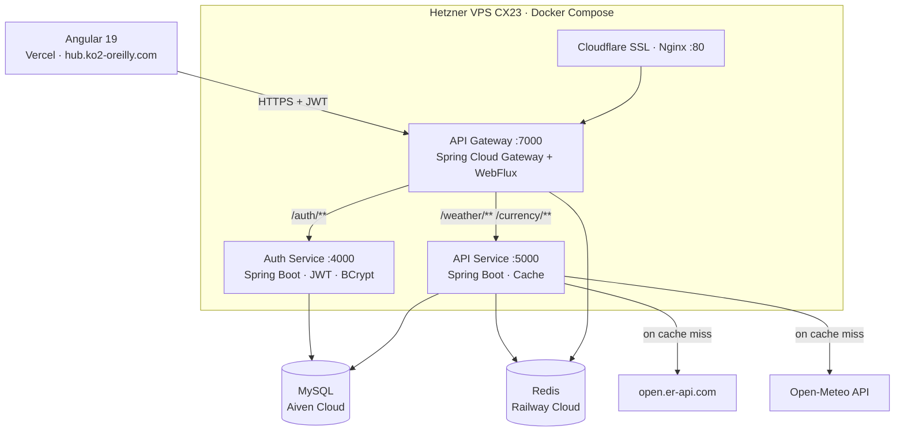

# KO2 Platform — Currency & Weather Hub


Real-time currency exchange and weather dashboard backed by three independently deployable Spring Boot microservices, secured with JWT and a multilevel cache.

---

## Architecture Overview



**Request flow (authenticated):**
1. Angular sends `Authorization: Bearer <token>` to `api.ko2-oreilly.com`
2. Cloudflare terminates TLS → Nginx proxies to Gateway on port 7000
3. Gateway validates JWT signature + checks Redis blacklist
4. Gateway injects `X-User-Name` / `X-User-Roles` headers downstream
5. API Service reads those headers via `HeaderAuthFilter` — no JWT re-validation

---

## Tech Stack

| Layer | Technology | Why |
|---|---|---|
| Frontend | Angular 19 — standalone components, RxJS, ngx-translate | Standalone API removes NgModules boilerplate; signals-ready for future migration |
| Gateway | Spring Cloud Gateway + WebFlux | Non-blocking I/O for routing; centralises auth so downstream services stay JWT-unaware |
| Auth Service | Spring Boot 3 · JWT HS256 · BCrypt | Isolated auth boundary; token blacklist in Redis covers logout without state on the gateway |
| API Service | Spring Boot 3 · JPA · RestTemplate | Handles business logic and cache independently of auth |
| Database | MySQL on Aiven | Managed cloud removes operational overhead for a solo-deployed project; automatic backups |
| Cache | Redis on Railway | Managed cloud; used for two distinct concerns: token blacklist (Gateway) and data TTL (API Service) |
| Infrastructure | Hetzner VPS CX23 | Best cost/performance ratio in Europe for a portfolio workload; avoids AWS complexity at this scale |
| Deployment | Docker Compose | Right-sized for three services on one host; Kubernetes would add orchestration overhead with no benefit here |
| SSL | Cloudflare Flexible | VPS has no certificate; Flexible terminates TLS at edge while Nginx proxies HTTP internally |

---

## Live Demo

| | URL |
|---|---|
| Frontend | [hub.ko2-oreilly.com](https://hub.ko2-oreilly.com) |
| API Docs (Swagger) | [167.235.77.17:7000/webjars/swagger-ui](http://167.235.77.17:7000/webjars/swagger-ui/index.html) |

**Test credentials:**

| Username | Password | Role |
|---|---|---|
| `user` | `user123` | ROLE_USER |
| `admin` | `admin123` | ROLE_ADMIN |

---

## Related Repositories

| Repo | Description | Visibility |
|---|---|---|
| [ko2-platform-frontend](https://github.com/ko2javier/ko2-platform-frontend) | Angular 19 SPA — dashboard, JWT auth, i18n (ES/EN/DE) | Public |
| `api-gateway-currency-data-hub` | Spring Cloud Gateway — JWT validation, Redis blacklist, routing | Private |
| `auth-currency-data-hub` | Auth Service :4000 — login, logout, token issuance, RBAC | Private |
| `currency-data-hub` | API Service :5000 — weather + currency endpoints, multilevel cache | Private |

---

## Key Technical Decisions

### 1. API Gateway owns authentication — services are JWT-unaware
The Gateway validates the JWT once and injects plain HTTP headers (`X-User-Name`, `X-User-Roles`) to downstream services. Downstream services use Spring Security with a `HeaderAuthFilter` — no JWT library dependency, no secret sharing. Changing the auth mechanism only requires touching the Gateway.

### 2. Token blacklist in Redis, not a database
On logout, the token TTL is preserved and used as the Redis key expiry. The blacklist is self-cleaning — no cron jobs, no table growth. MySQL would work but introduces a synchronous DB read on every authenticated request through the Gateway.

### 3. Multilevel cache with stale fallback
API Service resolves data in four steps: Redis (10 min TTL) → MySQL (< 10 min old) → external API → stale MySQL record as last resort. The fallback prevents hard failures when upstream APIs (Open-Meteo, ExchangeRate) are temporarily unavailable. Redis and MySQL serve different purposes: Redis for sub-millisecond hot reads, MySQL for persistence across Redis restarts.

### 4. Cloudflare Flexible over self-managed certificates
Adding Let's Encrypt to the VPS is straightforward, but Cloudflare Flexible removes that maintenance entirely and adds DDoS protection and edge caching at no operational cost. The trade-off (HTTP between Cloudflare and Nginx) is acceptable for a non-sensitive public portfolio workload.

---

## Testing

| | |
|---|---|
| Framework | JUnit 5 + Mockito |
| Tests passing | 15 (service layer + controller layer) |
| Coverage | 50.3% instructions (JaCoCo) |

**What is covered:** `WeatherService`, `CurrencyService`, `WeatherController`, `CurrencyController` — including Redis cache hit, DB cache hit/expired, external API call, stale fallback, and city-not-found (404) paths.

**What is not covered yet:** `WeatherClient`, `CurrencyClient` (external HTTP calls) and `HeaderAuthFilter` / `SecurityConfig` — these require a live MySQL + Redis instance and are the next step via Testcontainers.

**Run tests and generate report:**

```bash
./gradlew test jacocoTestReport
# HTML report: build/reports/jacoco/test/html/index.html
```

---

## Local Setup

<details>
<summary>Run with Docker Compose</summary>

### Prerequisites
- Docker + Docker Compose
- A `.env` file with the required variables (see below)

### Environment variables

```env
JWT_SECRET=your_secret_here
MYSQL_URL=jdbc:mysql://your-mysql-host:3306/ko2db
MYSQL_USER=your_user
MYSQL_PASSWORD=your_password
REDIS_HOST=your_redis_host
REDIS_PORT=6379
REDIS_PASSWORD=your_redis_password
AUTH_SERVICE_URL=http://auth-service:4000
API_SERVICE_URL=http://api-service:5000
```

### Start

```bash
git clone https://github.com/ko2javier/server-infrastructure.git
cd server-infrastructure
cp .env.example .env   # fill in your values
docker compose up -d
```

Services will be available at:
- Gateway: `http://localhost:7000`
- Swagger UI: `http://localhost:7000/webjars/swagger-ui/index.html`

</details>

---

## License

MIT
